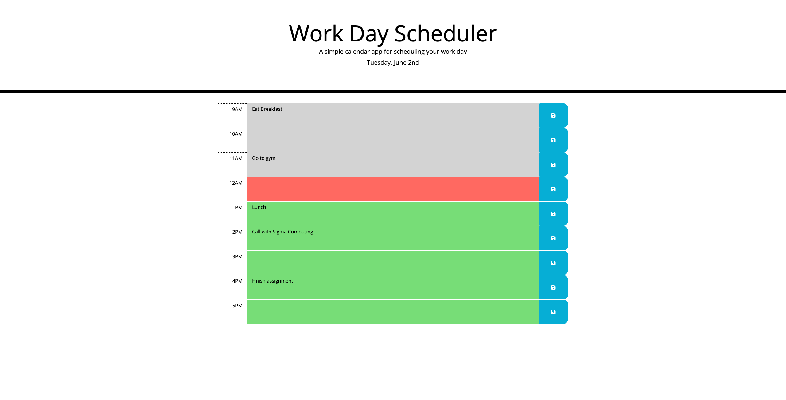

# Project Name - Work Day Scheduler
## Table of contents

- [Overview](#overview)
  - [The challenge](#the-challenge)
  - [User Story](#user-story)
  - [Acceptance Criteria](#acceptance-criteria)
  - [Screenshot](#screenshot)
  - [Links](#links)
- [My process](#my-process)
  - [Built with](#built-with)
  - [What I learned](#what-i-learned)
  - [Continued development](#continued-development)
  - [Useful resources](#useful-resources)
- [Author](#author)
- [Acknowledgments](#acknowledgments)

## Overview

### The challenge

The challenge of this assignment is to make a work day scheduler that uses bootstrap for the UI elements, and localStorage for saving data on the page.

### User Story

AS AN employee with a busy schedule
I WANT to add important events to a daily planner
SO THAT I can manage my time effectively

### Acceptance Criteria

GIVEN I am using a daily planner to create a schedule
WHEN I open the planner
THEN the current day is displayed at the top of the calendar
WHEN I scroll down
THEN I am presented with time blocks for standard business hours
WHEN I view the time blocks for that day
THEN each time block is color-coded to indicate whether it is in the past, present, or future
WHEN I click into a time block
THEN I can enter an event
WHEN I click the save button for that time block
THEN the text for that event is saved in local storage
WHEN I refresh the page
THEN the saved events persist

### Screenshot



### Links

- Solution URL: https://github.com/ayeh6/Work-Day-Scheduler
- Live Site URL: https://ayeh6.github.io/Work-Day-Scheduler/

## My process

### Built with

- HTML
- CSS
- Javascript
- jQuery
- Bootstrap

### What I learned

Biggest thing I learned in this assignment is how to use Bootstrap to style the elements. It was as simple as looking at documentation and then adding classes to certain elements, barely had to touch the css. I also got more experience with appending elements and having to add certain attributes and classes to them before appending. Though one thing I discovered which had me very confused was this snippet of code below:

```js
buttonEl.on('click',function() {
  saveEvent(i,textAreaEl.val());
});
```
Keep in mind this was in a for-loop that was creating different rows for the page. I was expecting the values of to be null/undefined or just give an error, but the values were true to what was needed for the function. Surprisingly the textAreaEl was able to grab the value of the textarea in the same row as the button, and the 'i' was the same value that it was when the for-loop was iterating. I'm assuming that jQuery is powerful enough to save the references of these values onto the on-click listener so when the button is clicked, it would search for the reference of that certain textAreaEl and grab the correct one. Taking advantage of this discovery, I made a function that passes the values in and saves the text input into localStorage.

### Continued development

As for continued development, I wanted to have the program be able to be dynamic and adjust itself if say the array of hours is changed. For now because the hours are set, I am able to just one-to-one connect the index of the localStorage to the index of a certain hour. But if the hours were to change, there would need to be another function that can add the hours missing from localStorage and be able to transfer the data seemlessly. I tried to implement something like that, but realize the time-complexity of the algorithm in mind was O(n^2) which is not ideal. Maybe a sliding-window approach would be appropriate, checking the hours missing on each end and then inserting when localStorage starts and ends.

### Useful resources

- [MomentJS](https://momentjs.com/) - This helped me with setting the date on the top using their function, and also to find the current hour.
- [w3schools](https://www.w3schools.com/) - Always a great resource for a beginning web developer, has a very useful jQuery examples.

## Author

- Website - [Andrew Yeh](https://ayeh6.github.io/Yeh-Andrew-Portfolio-Website/)
- LinkedIn - [/in/ayeh6](https://www.linkedin.com/in/ayeh6/)
